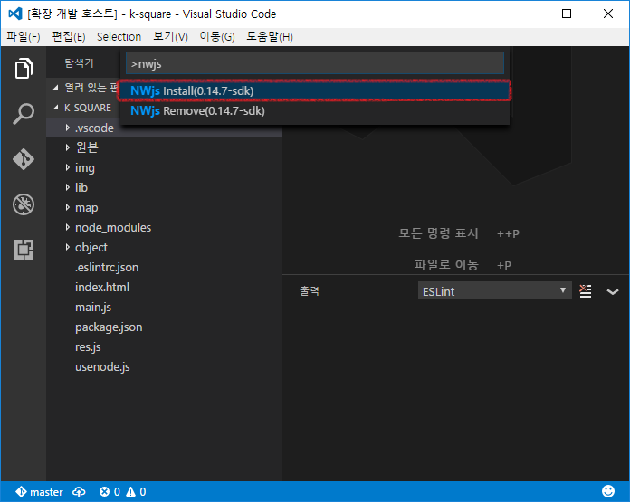

# NWjs README

Forked from `Debugger for Chrome`

Throw away typescript, and use javascript

NWjs version: `v0.14.7-sdk`

# Install

Need to install when first run

After install

Shortcut is `F5`

# Commands
* `NWjs Install(0.14.7 and SDK)` : Download NWjs and install
* `NWjs Remove(0.14.7 and SDK)` : Remove NWjs
* `NWjs Publish` : Generate `publish` directory and copy NWjs for publish
* `NWjs Compile` : Compile javascript with `nwjc`

# Issues

Sometimes NWjs terminate when use debug command. I don't known why..  want to fix
