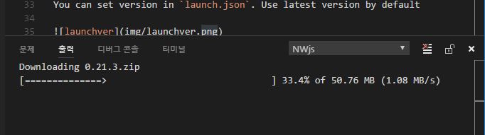
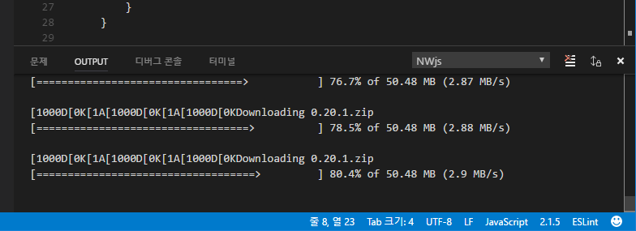
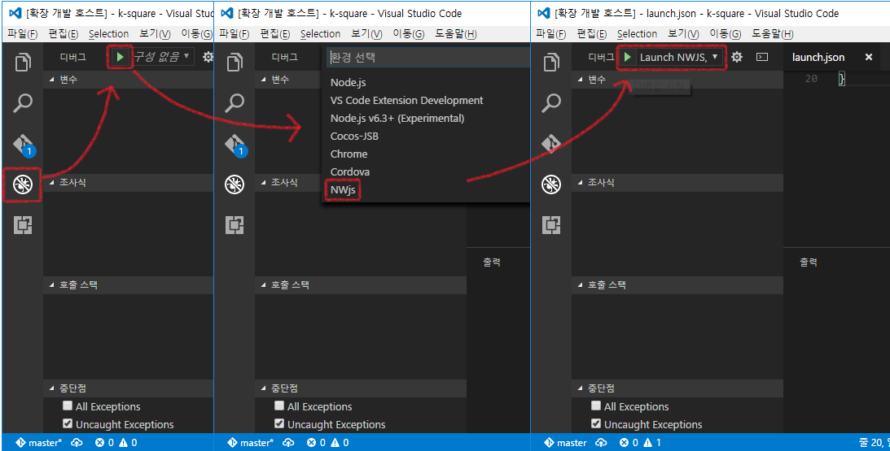
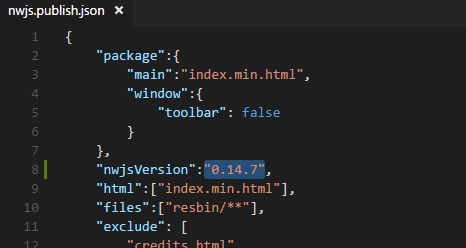

# NWjs README

Forked from `Debugger for Chrome`

English is not my mother tongue; please excuse any errors on my part.

## Install

Need to install when first run

You can open `command palette` with `F1` or `Ctrl + Shift + P`

Type `nwjs` to `command palette`

Select version, It takes a little while to open.

It will start the installation at `UserDir/.nwjs/version-names-nwjs`.
Wait install.

Launch NWjs

Shortcut is `F5`

## Use with multiple version

You can set version in `launch.json`. Use latest version by default

You can set version in `nwjs.publish.json` also.

## Commands
* `NWjs Install` : Download NWjs and install
* `NWjs Remove` : Remove NWjs
* `NWjs Publish` : Generate `publish` directory and copy NWjs for publish
* `NWjs Compile` : Compile javascript with `nwjc`

## Issues

Chrome debugger will attach little later after launch,  
If you want to debug a script that run immediately, You can use `Restart Debugger`(Ctrl+Shift+F5, It will just reload page)
