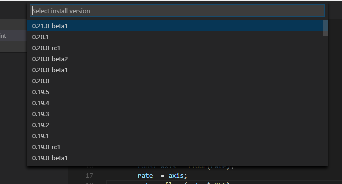
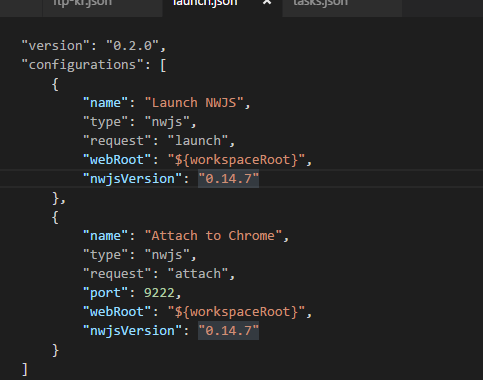

# NWjs README

Forked from `Debugger for Chrome`

NWjs version: `v0.14.7-sdk`

English is not my mother tongue; please excuse any errors on my part.

## Install

Need to install when first run

Select need version

Wait install

Launch NWjs

Shortcut is `F5`

## Use with multiple version

Set version in launch.json. Use latest version by default

Set version in nwjs.publish.json. Use latest version by default

## Commands
* `NWjs Install` : Download NWjs and install
* `NWjs Remove` : Remove NWjs
* `NWjs Publish` : Generate `publish` directory and copy NWjs for publish
* `NWjs Compile` : Compile javascript with `nwjc`

## Issues

Chrome debugger will attach little later after launch,  
If you want to debug a script that run immediately, You can use `Restart Debugger`(Ctrl+Shift+F5, It will just reload page)
